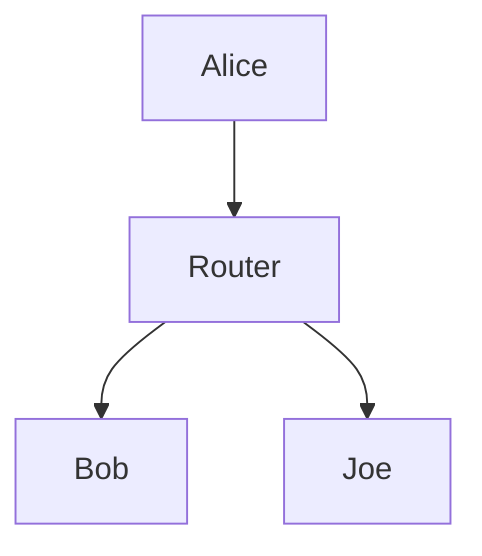
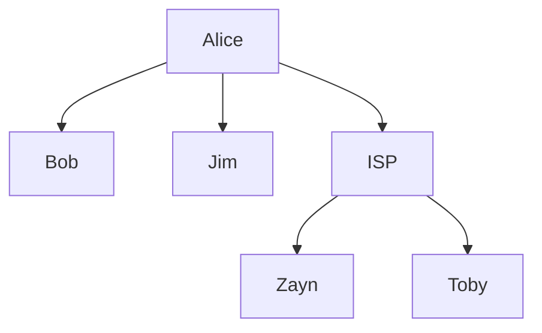
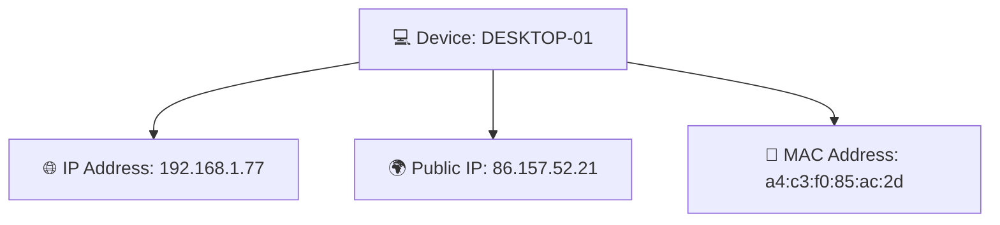
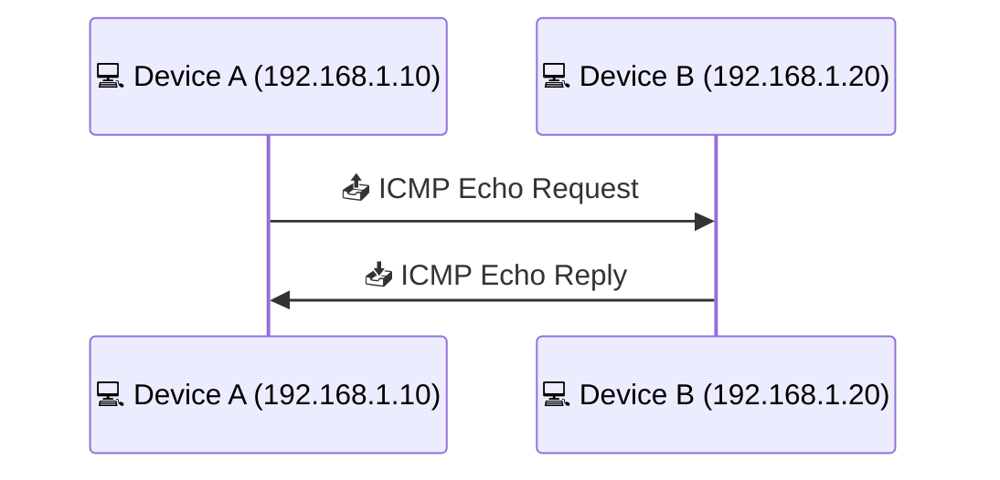
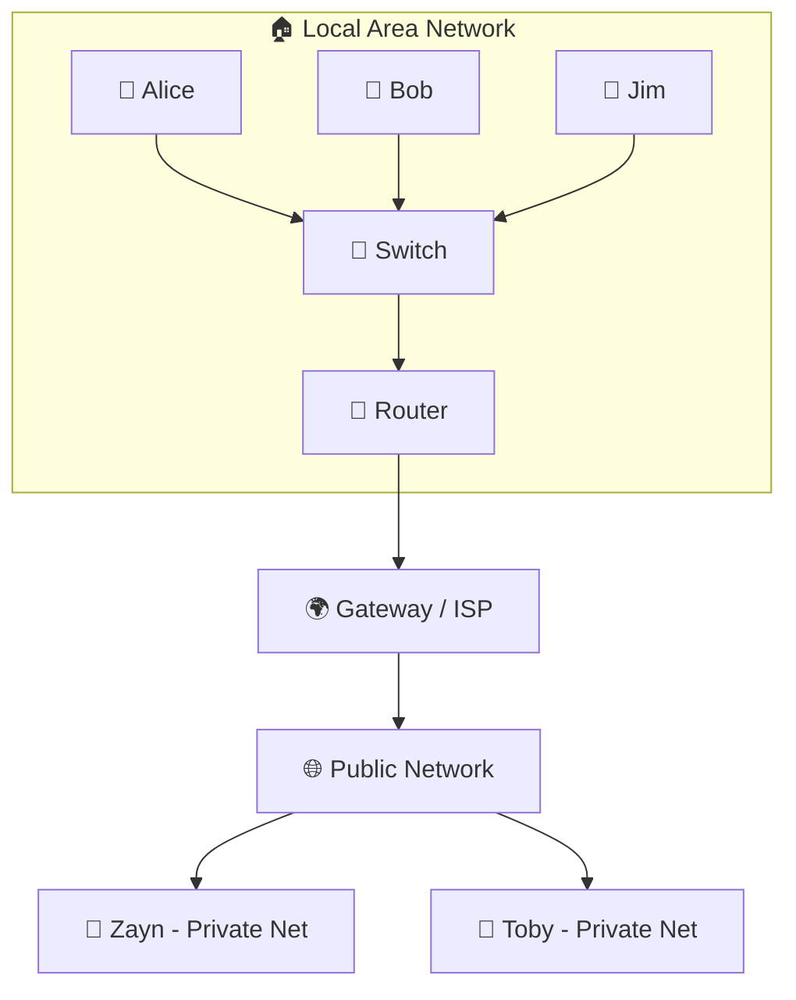

# Room: What is Networking?

## Task 1 – What is Networking?
**Question:** What is the key term for devices that are connected together?  
**Correct Answer:** Network ✅  

**Key Notes:**  
- A network = devices connected to share information.  
- Beispiele: Transport-Systeme, Stromnetze, Postdienste, Computergeräte.  
- In IT: Laptops, Smartphones, Kameras, Ampeln, etc.  
- Netzwerke sind die Grundlage jeder Cybersecurity-Strategie.

### 🔗 Simple Network Example

## Task 2 – What is the Internet?
**Question:** Who invented the World Wide Web?  
**Correct Answer:** Tim Berners-Lee ✅  

**Key Notes:**

- The Internet = a vast network made up of many smaller networks.
- Private networks (local) vs. public networks (the Internet).
- ARPANET (1960s) → the first documented computer network.
- World Wide Web (1989) → the modern Internet for storing and sharing information.

### 🌐 Internet Example

## Task 3 – Identifying Devices on a Network

## Key Notes
- Devices must be identifiable to communicate and maintain order.  
- Analogy: Humans have **names** (changeable) and **fingerprints** (permanent).  
- Devices have two identifiers:  
  - 🌐 **IP Address** → logical, can change.  
  - 🔑 **MAC Address** → physical, unique hardware ID.

## 🌐 IP Addresses
- **Definition:** Internet Protocol address identifies a host on a network for a period of time.  
- **Structure:** IPv4 = 4 octets (e.g., `192.168.1.77`).  
- **Private vs Public:**  
  - Private IP → identifies device within local network.  
  - Public IP → identifies device on the Internet (assigned by ISP).  
- **Shortage:** IPv4 = 2^32 (≈4.29 billion addresses).  
- **Solution:** IPv6 = 2^128 (≈340 trillion+ addresses), more efficient and scalable.

### Example Table
| Device Name   | IP Address   | Type   |
|---------------|--------------|--------|
| DESKTOP-KJE57FD | 192.168.1.77 | Private |
| DESKTOP-KJE57FD | 86.157.52.21 | Public  |
| CMNatic-PC      | 192.168.1.74 | Private |
| CMNatic-PC      | 86.157.52.21 | Public  |

## MAC Addresses
- **Definition:** Media Access Control address = unique hardware ID assigned at factory.  
- **Format:** 12‑character hexadecimal, split into pairs, separated by colons (e.g., `a4:c3:f0:85:ac:2d`).  
- **Structure:**  
  - First 6 characters → manufacturer.  
  - Last 6 characters → unique device ID.  
- **Spoofing:** Devices can fake MAC addresses → bypass weak security (e.g., hotel Wi‑Fi).  
- **Use Case:** Cafés/hotels often control access by MAC address.

## 🖧 Device Identification: IP vs MAC

**Legend:**

💻 Device → das Endgerät (PC, Laptop, Smartphone).

🌐 IP Address → logisch, kann sich ändern (wie eine Wohnadresse).

🌍 Public IP → vom ISP vergeben, sichtbar im Internet.

🔑 MAC Address → physisch, eindeutige Hardware-ID (wie ein Fingerabdruck).

**Questions:**  
- What does the term "IP" stand for? → **Correct Answer:** Internet Protocol ✅  
- What is each section of an IP address called? → **Correct Answer:** Octet ✅  
- How many sections does an IPv4 address have? → **Correct Answer:** 4 ✅  
- What does the term "MAC" stand for? → **Correct Answer:** Media Access Control ✅  
- Deploy the interactive lab using the "View Site" button and spoof your MAC address to access the site.  What is the flag? Flag from MAC spoofing lab → **Correct Answer:** THM{YOU_GOT_ON_TRYHACKME} ✅  

**Key Notes:**  
- Devices identified by **IP address** (temporary, can change) and **MAC address** (unique hardware ID).  
- IPv4 = 4.29 billion addresses → shortage → IPv6 (340 trillion+).  
- MAC spoofing kann schwache Sicherheitskonzepte umgehen (z. B. Hotel-WLAN).

## Task 4 – Ping (ICMP)
**Questions:**  
- What protocol does ping use? → **Correct Answer:** ICMP ✅  
- Syntax to ping 10.10.10.10 → **Correct Answer:** `ping 10.10.10.10` ✅  
- Flag from pinging 8.8.8.8 → **Correct Answer:** THM{I_PINGED_THE_SERVER} ✅  

**Key Notes:**  
- Ping = testet die Verbindung mit ICMP Echo Request/Reply.  
- Misst Latenz und Zuverlässigkeit.  
- Nützlich für Netzwerk-Fehleranalyse.

### Ping (ICMP) Communication

Legend:

📤 ICMP Echo Request → "Ping" signal sent from Device A to Device B.

📥 ICMP Echo Reply → Response from Device B confirming connectivity.

Ping measures latency (time taken) and reliability (packet loss).

## Task 5 – Continue Your Learning
**Action:** Join the "Intro to LAN" room. ✅  

---

## Skills Practiced
- Networking fundamentals (private vs public networks).  
- Device identification (IP vs MAC addresses).  
- IPv4 vs IPv6 addressing.  
- MAC spoofing concepts.  
- Ping and ICMP basics.

---
### 🖧 Networking Overview Diagram

Legend:

👩👨 Users/Devices → Endgeräte im LAN.

🔀 Switch → verbindet alle Geräte innerhalb des LAN.

📡 Router → verbindet das LAN mit dem ISP.

🌍 ISP → Gateway zum Internet.

🌐 Public Network (Internet) → weltweite Verbindung.

🔑 MAC Address → eindeutige Hardware‑ID.

🌐 IP Address → logische Adresse, kann sich ändern.
