# DNS in Detail

---

## Task 1 – What is DNS?

### Definition
- **DNS (Domain Name System)** is the “phonebook of the Internet.” 
- It translates **human‑friendly domain names** (e.g., `tryhackme.com`) into **IP addresses** (e.g., `104.26.10.229`).  
- Without DNS, users would need to remember long strings of numbers to access websites.  

### Q&A
- Q: What does DNS stand for?
- A: Domain Name System ✅

### Diagram – DNS Concept

## Task 2 – Domain Hierarchy
### Definition
- TLD (Top‑Level Domain): Rightmost part of a domain (e.g., .com, .co.uk).

- Second‑Level Domain: The name directly before the TLD (e.g., tryhackme).

- Subdomain: Prefix before the second‑level domain (e.g., admin.tryhackme.com).

### Q&A
- Q: What is the maximum length of a subdomain?
- A: 63 characters ✅

- Q: Which of the following characters cannot be used in a subdomain (3 b _ -)?
- A:_ (underscore) ✅

- Q: What is the maximum length of a domain name?
- A: 253 characters ✅

- Q: What type of TLD is .co.uk?
- A: ccTLD (Country Code Top‑Level Domain) ✅

### Diagram – Domain Hierarchy

### DNS Zone Hierarchy

### Explanation
- The **Root Zone (.)** is the top of the DNS hierarchy.  
- Below it are **Top-Level Domains (TLDs)** like `.com`, `.edu`, `.org`.  
- Each TLD contains **Second-Level Domains** (e.g., `redhat.com`, `duke.edu`).  
- These can contain **Third-Level Domains** (e.g., `cnn.redhat.com`, `chem.duke.edu`).  
- Each level represents a **zone**, which is an administrative boundary in DNS.

### Markdown Table – DNS Zone Breakdown

| Zone Level       | Example Domain         | Description                          |
|------------------|------------------------|--------------------------------------|
| Root Zone        | `.`                    | Top of the DNS hierarchy             |
| TLD              | `.com`, `.edu`         | Top-Level Domains                    |
| Second-Level     | `redhat.com`, `duke.edu` | Registered domain names              |
| Third-Level      | `cnn.redhat.com`, `chem.duke.edu` | Subdomains managed by domain owners |

## Task 3 – DNS Record Types
### Common DNS Records

| Record Type | Description                                 | Example                                           |
|-------------|---------------------------------------------|---------------------------------------------------|
| A Record    | Resolves to IPv4 addresses                  | `104.26.10.229`                                   |
| AAAA Record | Resolves to IPv6 addresses                  | `2606:4700:20::681a:be5`                          |
| CNAME Record| Resolves to another domain name             | `store.tryhackme.com → shops.shopify.com`        |
| MX Record   | Resolves to mail servers (with priority)    | `alt1.aspmx.l.google.com`                         |
| TXT Record  | Stores free text (ownership, SPF, verification) | `v=spf1 include:_spf.google.com ~all`        |

### Q&A
- Q: What type of record would be used to advise where to send email?
- A: MX Record ✅

- Q: What type of record handles IPv6 addresses?
- A: AAAA Record ✅

### Diagram – Record Types

```mermaid
graph TD
    Domain[tryhackme.com] --> A[A Record → IPv4]
    Domain --> AAAA[AAAA Record → IPv6]
    Domain --> CNAME[CNAME Record → Alias Domain]
    Domain --> MX[MX Record → Mail Server]
    Domain --> TXT[TXT Record → Text Data]
```

📘 Process
Client checks local cache.

If not found, query goes to Recursive DNS Server (usually ISP).

Recursive server queries Root DNS Servers.

Root redirects to correct TLD Server.

TLD server points to Authoritative DNS Server (nameserver).

Authoritative server returns the record → cached by recursive server → sent to client.

### Q&A

- Q: What field specifies how long a DNS record should be cached for?
- A: TTL (Time To Live) ✅

- Q: What type of DNS Server is usually provided by your ISP?
- A:	Recursive DNS Server ✅

- Q: What type of server holds all the records for a domain?	
- A: Authoritative DNS Server ✅

### Diagram – DNS Request Flow

## Task 5 – Practical
### Q&A

- Q: What is the CNAME of shop.website.thm?
- A: shops.shopify.com ✅
- Q: What is the value of the TXT record of website.thm?
- A: (e.g. v=spf1 include:_spf.google.com ~all) ✅
- Q: What is the numerical priority value for the MX record?
- A: (e.g. 10) ✅
- Q: What is the IP address for the A record of www.website.thm?	
- A: (e.g. 104.26.10.229) ✅

### Summary
- DNS: Translates domain names into IP addresses.

- Domain Hierarchy: TLD, second‑level domain, subdomains.

- Record Types: A, AAAA, CNAME, MX, TXT.

- Request Flow: Local cache → Recursive → Root → TLD → Authoritative → Client.

- Practical Queries: Show how to retrieve CNAME, TXT, MX, and A records.

### Final Overview Diagram – DNS Workflow

