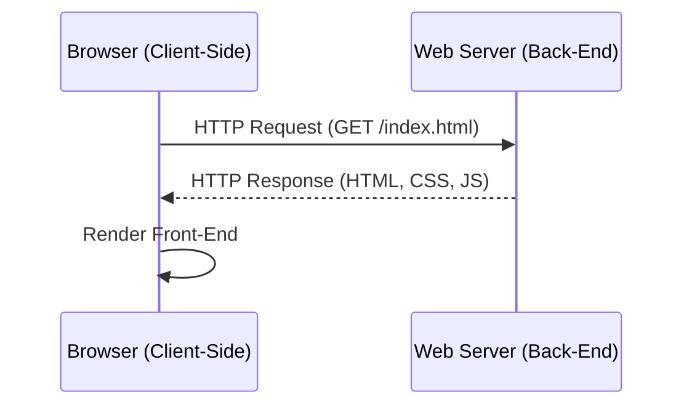
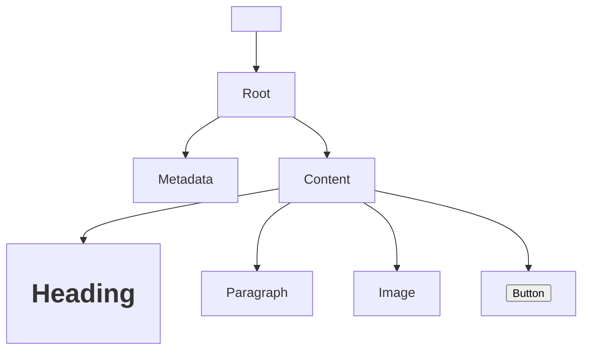
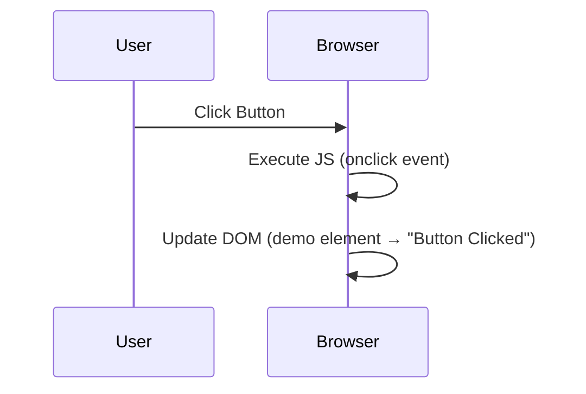
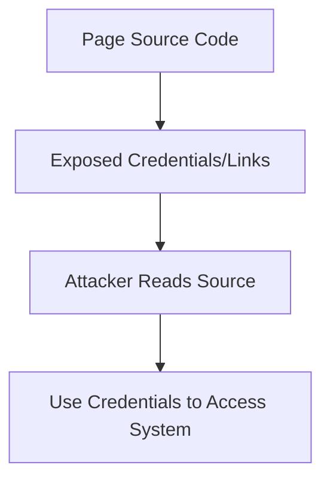
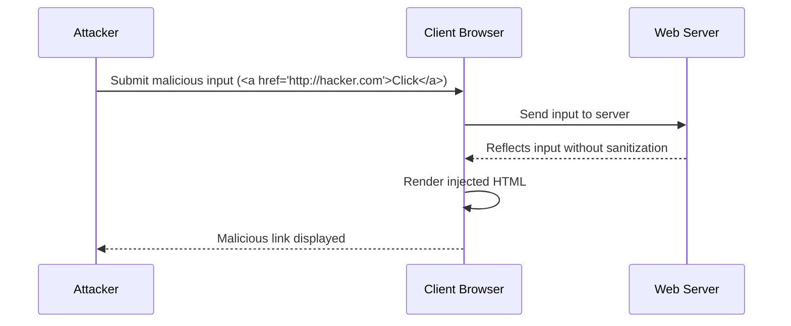

# How Websites Work 

## Task 1 – How Websites Work

### Definition
When you visit a website:
- Your **browser** (Chrome, Safari, Firefox) sends a **request** to a **web server**.
- The **server** responds with data (HTML, CSS, JS, images, etc.).
- The browser **renders** this data into a visible page.

### Components
1. **Front End (Client-Side):**  
   - What the browser renders.  
   - Built with HTML, CSS, JavaScript.  
2. **Back End (Server-Side):**  
   - Processes requests.  
   - Returns responses (data, logic, authentication).

### Diagram – Website Workflow

### Q&A
- Q: What term best describes the component of a web application rendered by your browser?
- A: Front End ✅


## Task 2 – HTML
### Definition
Websites are built with:

- HTML → Structure

- CSS → Styling

- JavaScript → Interactivity

### Example HTML
```html
<!DOCTYPE html>
<html>
<head>
  <title>My Page</title>
</head>
<body>
  <h1>Welcome!</h1>
  <p class="bold-text">Hello World</p>
  
</body>
</html>
```
### HTML Structure

| Element            | Purpose                                |
|--------------------|----------------------------------------|
| `<!DOCTYPE html>`  | Defines HTML5 document                  |
| `<html>`           | Root element                           |
| `<head>`           | Metadata (title, scripts, styles)      |
| `<body>`           | Visible content                        |
| `<h1>`             | Heading                                |
| `<p>`              | Paragraph                              |
| ``            | Image                                  |
| `<button>`         | Button                                 |


### Diagram – HTML Page Breakdown


### Q&A
- Q: Let's play with some HTML! First click the "View Site" button inside this task. On the right-hand side, you should see a box that renders HTML - 
If you enter some HTML into the box and click the green "Render HTML Code" button, it will render your HTML on the page; you should see an image of some cats.
- A: No answer needed ✅

- Q: One of the images on the cat website is broken - fix it, and the image will reveal the hidden text answer!
- A: HTMLHERO ✅

- Q: Add a dog image to the page by adding another img tag () on line 11. The dog image location is img/dog-1.png. What is the text in the dog image?
- A: DOGHTML ✅

## Task 3 – JavaScript

### Definition
- **JavaScript (JS):** One of the most popular programming languages in the world.  
- Used to make web pages **interactive**.  
- Works alongside:
  - **HTML** → Structure  
  - **CSS** → Styling  
  - **JavaScript** → Functionality  

Without JavaScript, websites would be **static** and lack interactivity.

### How JavaScript is Added
- Inline with `<script>` tags:
```html
<script>
  // JS code here
</script>
```
- Linked externally with the src attribute:

```html
<script src="/location/of/javascript_file.js"></script>
```
### Example – Change Content
```html
<p id="demo">Hello World</p>

<script>
document.getElementById("demo").innerHTML = "Hack the Planet";
</script>
```
### Example – Button with Event
```html
<button onclick='document.getElementById("demo").innerHTML = "Button Clicked";'>
  Click Me!
</button>
```
### Diagram – JavaScript Interaction Flow

### Q&A

- Q: Add JavaScript that changes the demo element's content to "Hack the Planet"	
- A: JSISFUN ✅
- Q: Add button HTML that changes text to "Button Clicked"
- A: No answer needed ✅
  
## Task 4 – Sensitive Data Exposure

### Definition
Sensitive Data Exposure occurs when a website **fails to protect or remove sensitive clear‑text information** in the frontend source code.  
Attackers can exploit this by viewing the **page source** and finding:
- Login credentials
- Hidden links to private areas
- API keys or tokens
- Debugging comments left by developers


### Example – Exposed Credentials in Source Code
```html
<!-- Temporary login: admin / testpasswd -->
If a developer forgets to remove this comment, anyone viewing the page source can see the credentials.
```

### Diagram – Sensitive Data Exposure Workflow

### Security Risk
- Frontend exposure: HTML/JS is visible to all users.

- Impact: Attackers can log in, escalate privileges, or access backend systems.

- Best Practice: Always sanitize and remove sensitive data before deployment.


### Q&A

- Q: View the website on this link. What is the password hidden in the source code?
- A:  testpasswd ✅

## Task 5 – HTML Injection

### Definition
- **HTML Injection** is a vulnerability that occurs when **unfiltered user input** is displayed directly on a web page.  
- If a website fails to **sanitize user input**, attackers can inject HTML or JavaScript code.  
- The browser will then render this malicious input as part of the page, allowing attackers to:
  - Change the page’s appearance.  
  - Insert malicious links.  
  - Execute JavaScript in the victim’s browser.  


### Example – Vulnerable Input
Suppose a form asks for your name and directly outputs it to the page:

```html
<p>Hello, USER_INPUT!</p>
```
If the developer does not sanitize input, an attacker could submit:

```html
<h1>Injected Heading</h1>
<a href="http://hacker.com">Click Here</a>
```
The browser would render the injected HTML as part of the page.

### Diagram – HTML Injection Flow

### Security Risk
- **Impact:**

   - Phishing attacks (malicious links).

   - Defacement of the website.

   - Execution of client-side scripts.

- **Mitigation:**

   - Always sanitize user input.

   - Escape HTML tags before rendering.

   - Use frameworks or libraries that enforce input validation.

### Q&A

- Q: Inject HTML so that a malicious link to http://hacker.com is shown
- A: HTML_INJ3CTI0N ✅
