# Extending Your Network
## Task 1: Introduction to Port Forwarding
### Definition
- Port Forwarding allows external devices to access services inside a private network.

- Without it, services (like a web server on port 80) are only accessible within the local intranet.

- Configured at the router.

### Example
- Internal server: 192.168.1.10:80 (only accessible locally).

- Public access via port forwarding: 82.62.51.70:80.

### Diagram – Port Forwarding

**Explanation:**  
- Internal server (`192.168.1.10:80`) is only accessible locally.  
- Router forwards traffic from public IP (`82.62.51.70:80`) to the internal server.  
- External clients can now connect. 

### Q&A
- Q: What is the name of the device that is used to configure port forwarding?
- A: Router ✅

## Task 2 – Firewalls 101

### Definition
Ein **Firewall** kontrolliert, welcher Netzwerkverkehr hinein- oder hinausgelassen wird.  
- Funktioniert wie Grenzkontrolle: prüft Pakete nach Quelle, Ziel, Port und Protokoll.  
- Arbeitet auf **Layer 3 (Network)** und **Layer 4 (Transport)** des OSI‑Modells.  

### Kategorien

| Category   | Description                                   |
|------------|-----------------------------------------------|
| **Stateful**  | Inspects the entire connection (context‑aware). |
| **Stateless** | Inspects individual packets only.             |

###  Q&A
- **Q:** What layers of the OSI model do firewalls operate at?  
  **A:** Layer 3, Layer 4  ✅

- **Q:** What category of firewall inspects the entire connection?  
  **A:** Stateful  ✅

- **Q:** What category of firewall inspects individual packets?  
  **A:** Stateless  ✅

### Diagram – Firewall Packet Flow

```mermaid
flowchart TD
    Internet[🌐 Internet Traffic] --> Firewall[🛡️ Firewall Rules]
    Firewall -->|Allowed| Internal[🏠 Internal Network]
    Firewall -->|Blocked| Dropped[❌ Dropped Packets]
```

### Explanation
- **Internet Traffic** reaches the firewall.  
- The **Firewall** inspects packets according to rules (source, destination, port, protocol).  
- **Allowed packets** are forwarded into the internal network.  
- **Blocked packets** are discarded.

## Task 3: Practical – Firewall
### Scenario
- Malicious packets from 198.57.100.34 overload the user machine 203.0.110.1.

- Solution: Block the attacker’s IP and port at the firewall.

- Result: Packets are dropped, preventing overload.

### Diagram – Blocking Malicious IP

```mermaid
flowchart TD
    Attacker[Attacker: 198.57.100.34] --> Firewall[🛡️ Firewall]
    Firewall -->|Blocked| Dropped[❌ Dropped Packets]
    Firewall -->|Allowed| Victim[User Machine: 203.0.110.1]
```

### Q&A
- Q: What is the flag?
- A: THM{FIREWALLS_RULE} ✅

## Task 4 – VPN Basics

### Definition
A **Virtual Private Network (VPN)** creates a secure tunnel between devices across the Internet.  
Devices in the tunnel form a private network, even if geographically separated. 
VPNs provide confidentiality, integrity, and authentication for data.

### Diagram – VPN Tunnel

```mermaid
flowchart TD
    Client[💻 Client Device] --> Tunnel[🔒 VPN Tunnel]
    Tunnel --> Server[🌐 VPN Server]
    Server --> PrivateNet[🏠 Private Network]

    Internet[🌍 Public Internet] -.-> Tunnel
```

**Explanation:**  
- The client connects to the VPN server through the public Internet.  
- A secure **encrypted tunnel** is established.  
- Devices inside the tunnel communicate as if they were on the same private LAN.

### Benefits
| Benefit                  | Description                                      |
|---------------------------|--------------------------------------------------|
| Secure communication      | Devices exchange data safely over the Internet.  |
| ISP protection            | Prevents ISPs from flagging traffic as malicious.|
| Hidden vulnerable machines| Protects TryHackMe labs from direct Internet exposure. |

### VPN Technologies

| Technology | Layer/Framework | Features | Use Cases |
|------------|-----------------|----------|-----------|
| **PPP (Point-to-Point Protocol)** | Data Link Layer | Provides encryption & authentication only | Legacy VPNs, dial-up connections |
| **IPSec (Internet Protocol Security)** | Network Layer (IP framework) | Encrypts, authenticates, ensures integrity | Modern site-to-site VPNs, secure corporate tunnels |
| **SSL/TLS VPN** | Transport Layer | Uses HTTPS (443), easy to deploy | Remote access VPNs, browser-based access |
| **L2TP (Layer 2 Tunneling Protocol)** | Data Link Layer | Often combined with IPSec for security | ISP VPNs, enterprise VPNs |
| **OpenVPN** | Application Layer | Open-source, flexible, strong encryption | Widely used for personal & corporate VPNs |

### Diagram – PPP vs IPSec

**Explanation:**  
- **PPP:** Lightweight, only encrypts & authenticates. Mostly legacy.  
- **IPSec:** Full security suite – encryption, authentication, and integrity. Standard for modern VPNs.  

### Q&A
- Q: What VPN technology only encrypts & provides the authentication of data?
- A: PPP ✅
- Q: What VPN technology uses the IP framework?
- A: IPSec ✅

## Task 5 – LAN Networking Devices

### Router
- Connects networks and passes data between them.  
- Operates at **Layer 3** of the OSI model.  
- Uses routing protocols to determine optimal paths.  

### Switch
- Connects multiple devices within a LAN.  
- **Layer 2 Switch:** Forwards frames using MAC addresses.  
- **Layer 3 Switch:** Routes packets using IP addresses.  
- VLANs allow logical separation of devices for security.

### Diagram – Router vs Switch

```mermaid
graph TD
    Router[Router - Layer 3] --> Internet[🌐 Internet]
    Switch2[Layer 2 Switch] --> Devices[💻 LAN Devices]
    Switch3[Layer 3 Switch] --> Devices
    Switch3 --> Internet
```

### Explanation
- **Router:** Operates at Layer 3, connects different networks, and decides the best path for packets.  
- **Layer 2 Switch:** Operates at the Data Link layer, forwards frames based on MAC addresses.  
- **Layer 3 Switch:** Combines switch + router functions, forwarding frames and routing packets using IP addresses.  
- **VLANs:** Provide logical separation of devices for security and efficiency.

### Q&A
- Q: What is the verb for the action that a router does?
- A: Routing ✅ 

- Q: What are the two different layers of switches?
- A: Layer2, Layer3 ✅

## Task 6 – Practical: Network Simulator

### Scenario
Simulation of sending a TCP packet from **Computer 1** to **Computer 3**.  
After the **three‑way handshake** and data transfer, the flag is revealed. 

### Diagram – TCP Handshake & Data Transfer

### Q&A
- Q: What is the flag from the network simulator?
- A: THM{YOU’VE_GOT_DATA} ✅

- Q: How many HANDSHAKE entries are there in the Network Log?
- A: 5 ✅

### Summary
- Port Forwarding: Opens internal services to the Internet.

- Firewalls: Control traffic flow, stateful vs stateless.

- VPNs: Secure tunnels across networks.

- Routers & Switches: Core LAN devices with different OSI layer functions.

- Practical Labs: Reinforce concepts with flags and simulations.
