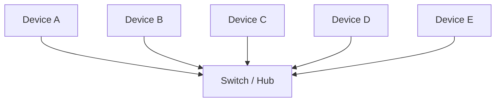
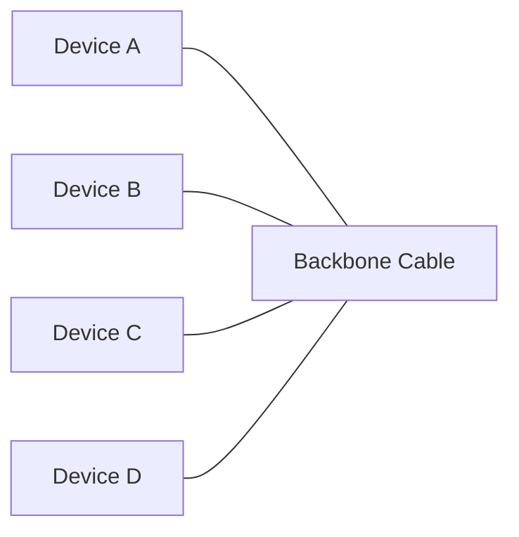
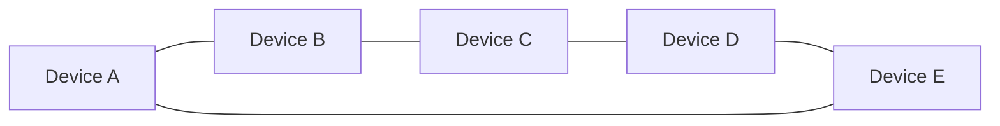
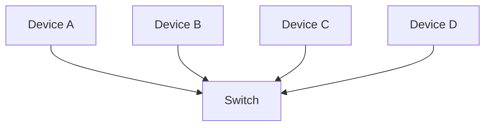
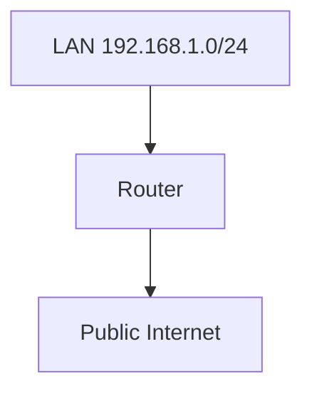
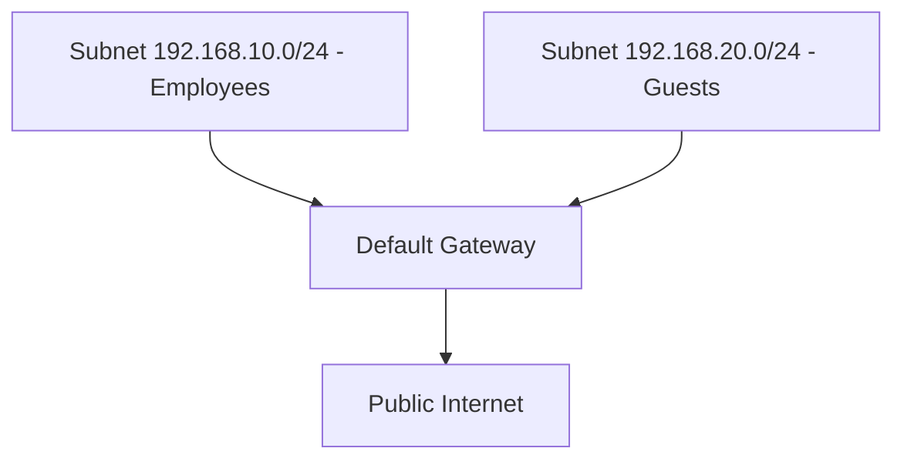
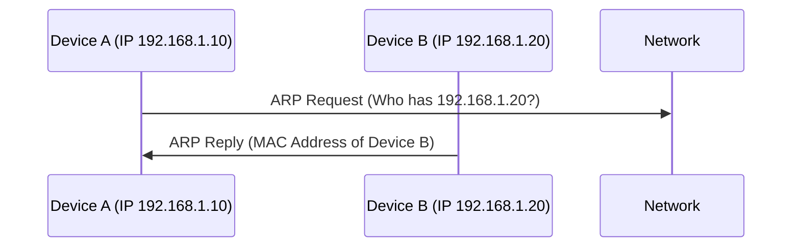

/Intro LAN

# 🖧 Local Area Network (LAN) – Introduction

## What is a LAN?

A Local Area Network (LAN) connects devices within a limited area (home, office, campus).

Purpose: share resources (files, printers, Internet access) and enable communication.

LANs are the foundation of networking and the building block for larger networks (WAN, Internet).

## LAN Components

- Devices (Nodes) → PCs, laptops, printers, smartphones.

- Switch → central device that interconnects all nodes in the LAN.

- Router → connects the LAN to external networks (ISP, Internet).

- ISP (Gateway) → provides access to the public Internet.

## 🖧 LAN Topologies

### Star Topology
- Star Topology Devices connect via a central switch/hub. Reliable and scalable, but more expensive.



**Notes:**  
- All devices connect to a central switch/hub.  
- Reliable and scalable, but more expensive.  

### Bus Topology
- Bus Topology Devices share one backbone cable. Cost‑efficient, but prone to bottlenecks and failures.


**Notes:**  
- All devices share one backbone cable.  
- Cost‑efficient, but prone to bottlenecks and failures.  

### Ring Topology
- Ring Topology Devices form a loop. Easy troubleshooting, but one fault breaks the entire network.


**Notes:**  
- Devices form a closed loop.  
- Easy troubleshooting, but one fault breaks the entire network.

# 🔀 Switches
## Definition
A Switch is a dedicated networking device designed to connect multiple endpoints (computers, printers, servers) using Ethernet. Each device plugs into a physical port on the switch. Switches are available in different sizes (4, 8, 16, 24, 32, or 64 ports).

## How it Works
- Operates at Layer 2 (Data Link Layer) of the OSI model.

- Builds a MAC address table by learning which device is connected to which port.

- Forwards packets only to the correct destination port, unlike a hub which floods all ports.

- Reduces unnecessary traffic and improves efficiency.

## Example
- Device A (MAC: 00:11:22:33:44:55) is connected to Port 1.

- Device B (MAC: 66:77:88:99:AA:BB) is connected to Port 2.

- When A sends data to B, the switch forwards it directly from Port 1 to Port 2.

## Diagram


# 📡 Routers
## Definition
A Router connects different networks and ensures data packets travel from one network to another. Routers operate at Layer 3 (Network Layer) of the OSI model.

## How it Works
- Uses IP addresses to forward traffic.

- Maintains routing tables with paths to other networks.

- Routing can be static (manually configured) or dynamic (using protocols like OSPF, RIP, BGP).

## Example
- A home router connects the LAN (192.168.1.0/24) to the Internet.

- Devices in the LAN send traffic to the router, which forwards it using the public IP.

## Diagram

# 🌐 Subnetting
## Definition
Subnetting is the process of dividing a larger network into smaller sub‑networks (subnets). This is done using a subnet mask (32 bits, four octets).

## How it Works
- Network Address → identifies the network (e.g., 192.168.1.0).

- Host Address → identifies a device within the network (e.g., 192.168.1.10).

- Default Gateway → device that forwards traffic outside the subnet (e.g., 192.168.1.254).

## Example
- A café separates its networks:

- Employee Network: 192.168.10.0/24

- Guest Network: 192.168.20.0/24 Both connect to the Internet via the same router.

## Diagram


# ARP Protocol
## Definition
The Address Resolution Protocol (ARP) maps logical addresses (IP) to physical addresses (MAC).

## How it Works
- Device A wants to communicate with Device B (IP 192.168.1.20).

- A sends an ARP Request: “Who has IP 192.168.1.20?”

- B replies with an ARP Reply: “I have that IP, my MAC is 66:77:88:99:AA:BB.”

- A stores this mapping in its ARP cache.

## Diagram

# DHCP Protocol
## Definition
The Dynamic Host Configuration Protocol (DHCP) automatically assigns IP addresses to devices joining a network.

## How it Works
- Discover → Device broadcasts request for an IP.

- Offer → DHCP server proposes an IP.

- Request → Device accepts the offered IP.

- ACK → Server confirms and assigns the IP.

## Example
- A laptop connects to Wi‑Fi.

- The DHCP server assigns it IP 192.168.1.50 automatically.

## Diagram
```mermaid
sequenceDiagram
    participant Client as Device (Client)
    participant Server as DHCP Server

    Client->>Server: DHCP Discover
    Server->>Client: DHCP Offer
    Client->>Server: DHCP Request
    Server->>Client: DHCP ACK
  ```
# Summary
- Switches → Efficiently connect devices within a LAN.

- Routers → Connect different networks and forward traffic to the Internet.

- Subnetting → Divides networks for efficiency, security, and control.

- ARP → Maps IP addresses to MAC addresses.

- DHCP → Automates IP assignment for devices.

# Answers
## Task 1
What does LAN stand for?
- **Coerrect Answer:** Local Area Network ✅

What is the verb given to the job that Routers perform?
- **Coerrect Answer:** Routing ✅

What device is used to centrally connect multiple devices on the local network and transmit data to the correct location?
- **Coerrect Answer:** Switch ✅

What topology is cost-efficient to set up?
- **Coerrect Answer:** Bus Topology ✅

What topology is expensive to set up and maintain?
- **Coerrect Answer:** Star Topology ✅

Complete the interactive lab attached to this task. What is the flag given at the end?
- **Coerrect Answer:** THM{TOPOLOGY_FLAWS} ✅

## Task 2
What is the technical term for dividing a network up into smaller pieces?
- **Coerrect Answer:** Subnetting ✅

How many bits are in a subnet mask?
- **Coerrect Answer:** 32 ✅

What is the range of a section (octet) of a subnet mask?
- **Coerrect Answer:** 0–225 ✅

What address is used to identify the start of a network?
- **Coerrect Answer:** Network Address ✅

What address is used to identify devices within a network?
- **Coerrect Answer:** Host Address ✅

What is the name used to identify the device responsible for sending data to another network?
- **Coerrect Answer:** Default Gateway ✅

## Task 3
What does ARP stand for?
- **Correct Answer:** Address Resolution Protocol ✅

What category of ARP Packet asks a device whether or not it has a specific IP address?
- **Correct Answer:** Request ✅

What address is used as a physical identifier for a device on a network?
- **Correct Answer:** MAC Address ✅

What address is used as a logical identifier for a device on a network?
- **Correct Answer:** IP Address ✅

## Task 4
What type of DHCP packet is used by a device to retrieve an IP address?
- **Correct Answer:** DHCP Discover ✅

What type of DHCP packet does a device send once it has been offered an IP address by the DHCP server?
- **Coerrect Answer:** DHCP Request ✅
  
Finally, what is the last DHCP packet that is sent to a device from a DHCP server?
- **Coerrect Answer:** DHCP ACK ✅

