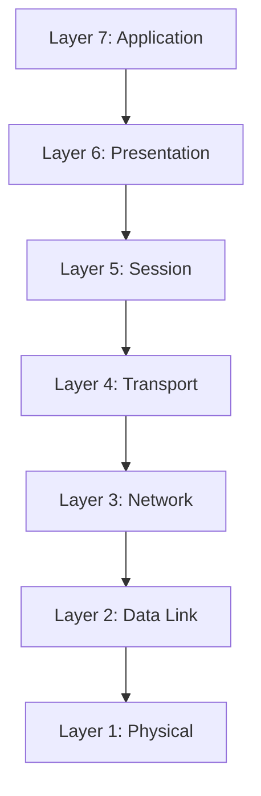
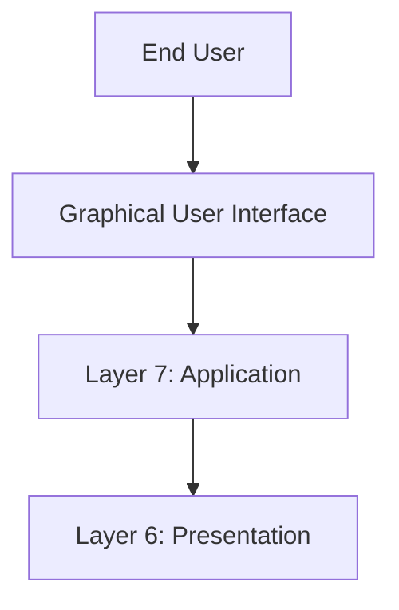
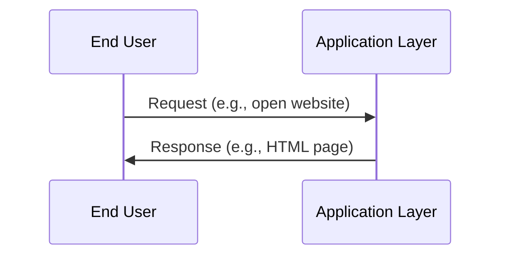
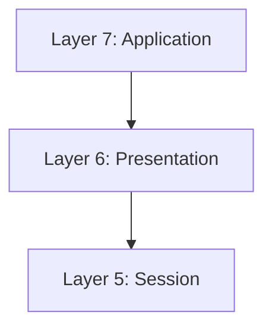
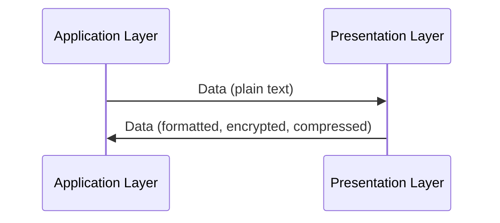
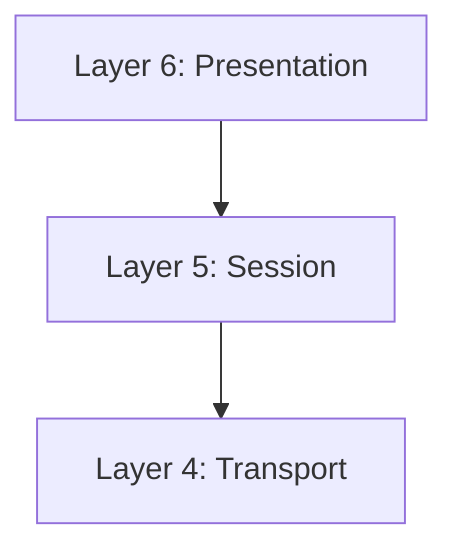
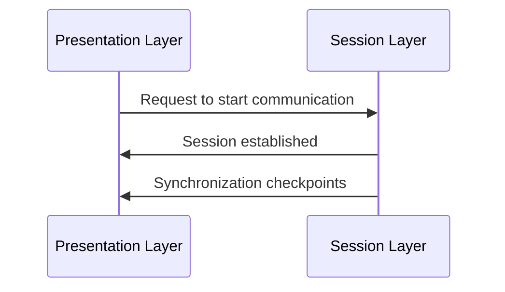
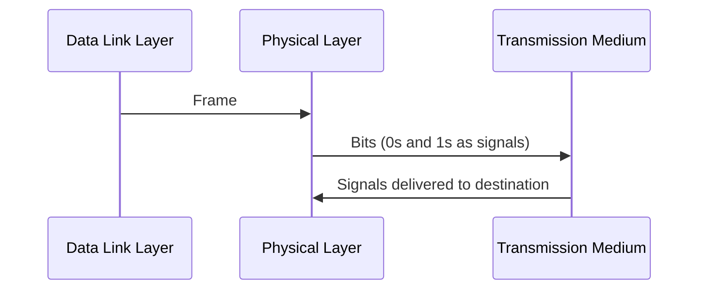

# OSI Model 
# Task 1 – What is the OSI Model?
## Introduction
The OSI (Open Systems Interconnection) Model is a seven‑layer framework that standardizes how devices communicate across networks.

- It ensures interoperability between different hardware and software systems.

- Each layer has a specific role in the communication process.

- Data moves through the layers using encapsulation: each layer adds its own header/trailer to the data.

- Layers are numbered from 7 (Application) down to 1 (Physical).

## OSI Layer Stack Diagram


## Questions & Answers
- Q1: What does the “OSI” in “OSI Model” stand for?
- A: Open Systems Interconnection ✅

- Q2: How many layers (in digits) does the OSI model have?
- A: 7 ✅

- Q3: What is the key term for when pieces of information get added to data?
- A: Encapsulation ✅
  
# Task 2 – Layer 7: Application
## Definition
The Application Layer is the top layer (Layer 7) of the OSI Model.

- It acts as the gateway between the user and the network.

- Provides the protocols and services that allow applications to communicate over a network.

- Defines how users interact with data through software interfaces.

## Functions
- User Interaction: Provides a direct interface for end‑users to access network services.

- Protocol Handling: Implements protocols such as HTTP, SMTP, FTP, and DNS.

- Data Services: Enables file transfers, email exchange, and web browsing.

- Translation: Works with the Presentation Layer to ensure data is usable by applications.

## Examples
- Email Clients → Outlook, Thunderbird (using SMTP/IMAP/POP3).

- Web Browsers → Chrome, Firefox, Edge (using HTTP/HTTPS).

- File Transfer Tools → FileZilla (using FTP).

- DNS Services → Translate human‑readable domain names (e.g., example.com) into IP addresses.

## Key Concept
- Graphical User Interface (GUI): The technical term for the software interface that users interact with.

- Without the Application Layer, users would not have a way to access or request network services.

## Diagram – Application Layer in Context

### (User Interaction)

- What happens: User interacts with applications (browser, email client). Protocols like HTTP, SMTP, FTP operate here.
## Questions & Answers
- Q1: What is the name of this Layer?
- A: Application ✅

- Q2: What is the technical term that is given to the name of the software that users interact with?
- A: Graphical User Interface (GUI) ✅

# Task 3 – Layer 6: Presentation
## Definition
The Presentation Layer is Layer 6 of the OSI Model.

- It ensures that data exchanged between applications is represented in a consistent, standardized format.

- Acts as a translator between the Application Layer (Layer 7) and the lower layers of the network stack.

- Without this layer, applications with different internal designs would struggle to interpret each other’s data correctly.

## Functions
- Data Translation: Converts data into a format that both sender and receiver applications can understand.

- Data Compression: Reduces the size of data for efficient transmission (e.g., JPEG, MP3).

- Data Encryption: Provides security features such as SSL/TLS (HTTPS) for secure communication.

- Syntax & Semantics: Ensures that the meaning and structure of data remain consistent across systems.

## Examples
- Email Clients: Even if two email programs have different GUIs, the Presentation Layer ensures the message content is displayed consistently.

- Web Security: HTTPS encryption occurs at this layer, protecting sensitive information.

- File Formats: Converting between formats like ASCII, EBCDIC, or Unicode for text representation.

## Key Concept
- The Presentation Layer is often called the “translator” of the OSI Model.

- It guarantees that data is usable and secure before being passed to the Application Layer.

## Diagram – Presentation Layer in Context

### (Translation & Encryption)

- What happens: Data is translated, encrypted (SSL/TLS), or compressed (JPEG, MP3) for consistent representation.
## Questions & Answers
- Q1: What is the name of this Layer?
- A: Presentation ✅ 

- Q2: What is the main purpose that this Layer acts as?
- A: Translator ✅

# Task 4 – Layer 5: Session
## Definition
The Session Layer is Layer 5 of the OSI Model.

- Its primary role is to establish, manage, and terminate sessions between two devices.

- A session is a dedicated communication channel that ensures both devices are synchronized before data exchange begins.

- This layer provides dialog control, ensuring that data flows in the correct order and without overlap.

## Functions
- Connection Establishment: Creates a session between two devices before data transfer begins.

- Synchronization: Ensures both devices agree on communication parameters.

- Data Segmentation: Breaks data into smaller, manageable chunks called packets.

- Error Recovery: If a connection drops, only unsent packets are retransmitted, not the entire dataset.

- Session Uniqueness: Each session is distinct; data cannot be transmitted across multiple sessions simultaneously.

## Examples
- Video Conferencing: Establishes a session between participants to manage continuous communication.

- Online Gaming: Maintains a session so progress can resume from a checkpoint if interrupted.

- File Transfers: Ensures that if a transfer is interrupted, only missing packets are resent.

## Key Concept
- The Session Layer is often compared to a “conversation manager”.

- It ensures that communication between devices is organized, synchronized, and recoverable.

## Diagram – Session Layer in Context

### (Connection Management)

- What happens: Sessions are established, maintained, and terminated. Synchronization ensures reliable communication.
## Questions & Answers
- Q1: What is the name of this Layer?
- A: Session ✅

- Q2: What is the technical term for when a connection is successfully established?
- A: Session ✅

- Q3: What is the technical term for “small chunks of data”?
- A: Packets ✅

# Task 5 – Layer 4: Transport
## Definition
The Transport Layer is Layer 4 of the OSI Model.

- It is responsible for end‑to‑end communication between devices.

- Ensures that data is delivered reliably or quickly depending on the protocol used.

- Provides segmentation, error detection, and flow control.

## Functions
- Segmentation: Breaks data into smaller units (segments) for transmission.

- Error Checking: Ensures data integrity (TCP).

- Flow Control: Prevents network congestion by managing data rates.

- Multiplexing: Allows multiple applications to use the network simultaneously.

## Protocols
### TCP – Transmission Control Protocol
- Reliable, connection‑oriented protocol.

- Establishes a dedicated connection before data transfer.

- Performs error checking and ensures packets are received in the correct order.

### Advantages:

- Guarantees accuracy and completeness.

- Synchronizes devices to prevent flooding.

### Disadvantages:

- Slower due to reliability checks.

- Requires stable connections.

- Examples: Email, file downloads, web browsing.

### UDP – User Datagram Protocol
- Fast, connectionless protocol.

- Sends packets without error checking or guaranteed delivery.

### Advantages:

- Very fast and lightweight.

- Flexible for developers.

- Works well in unstable environments.

### Disadvantages:

- No guarantee of delivery.

- Not suitable for critical data transfers.

- Examples: Streaming video, VoIP, gaming, ARP/DHCP discovery.

## Diagram – Transport Layer in Context
```mermaid
sequenceDiagram
    participant Sess as Session Layer
    participant Trans as Transport Layer
    participant Net as Network Layer

    Sess->>Trans: Data Segments
    Trans->>Net: TCP Segment (Reliable, Ordered, Error-checked)
    Trans->>Net: UDP Datagram (Fast, No Guarantee)
  ```
### What happens:

- The Session Layer passes data to the Transport Layer.

- Transport Layer decides whether to use TCP (reliable) or UDP (fast).

- Segments are then passed to the Network Layer for routing.

## Questions & Answers
- Q1: What is the name of this Layer?
- A: Transport ✅

- Q2: What does TCP stand for?
- A: Transmission Control Protocol ✅

- Q3: What does UDP stand for?
- A: User Datagram Protocol ✅

- Q4: What protocol guarantees the accuracy of data?
- A: TCP ✅

- Q5: What protocol doesn’t care if data is received or not by the other device?
- A: UDP ✅

- Q6: What protocol would an application such as an email client use?
- A: TCP ✅

- Q7: What protocol would an application that downloads files use?
- A: TCP ✅

- Q8: What protocol would an application that streams video use?
- A: UDP ✅

# Task 6 – Layer 3: Network
## Definition
The Network Layer is Layer 3 of the OSI Model.

- It is responsible for routing, addressing, and reassembly of packets.

- Ensures that data travels across multiple networks and reaches the correct destination.

- Provides logical addressing using IP addresses.

- Devices such as routers operate at this layer.

## Functions
- **Routing:** Determines the most efficient path for packets to travel across networks.

- **Reassembly:** Reconstructs fragmented packets into their original form.

- **Logical Addressing:** Uses IP addresses to identify devices.

- **Path Selection Factors:**

  - Path Length: Fewer hops are preferred.

  - Reliability: Avoids routes with packet loss.

  - Bandwidth: Prefers faster connections (fiber vs copper).

## Examples
- **Routers:** Forward packets between LANs and the Internet using IP addresses.

- **Protocols:**

   - OSPF (Open Shortest Path First): Chooses the shortest and most efficient route.

   - RIP (Routing Information Protocol): Uses hop count to determine routes.

- **IP Addressing:** Example → Device with IP 192.168.1.100 is identified at this layer.

## Key Concept
- The Network Layer is the “navigator” of the OSI Model.

- It ensures packets take the optimal route to reach their destination.

## Diagram – Network Layer in Context
```mermaid
sequenceDiagram
    participant Trans as Transport Layer
    participant Net as Network Layer
    participant Router as Router
    participant Dest as Destination Device

    Trans->>Net: Segments
    Net->>Router: Packets with IP addresses
    Router->>Dest: Forwarded packets via optimal route
  ```
### What happens:

- Transport Layer passes segments to the Network Layer.

- Network Layer encapsulates them into packets with IP addresses.

- Routers forward packets along the most efficient path to the destination.

## Questions & Answers
- Q1: What is the name of this Layer?
- A: Network ✅

- Q2: Will packets take the most optimal route across a network?
- (Y/N) A: Y ✅

- Q3: What does the acronym “OSPF” stand for?
- A: Open Shortest Path First ✅

- Q4: What does the acronym “RIP” stand for?
- A: Routing Information Protocol ✅

- Q5: What type of addresses are dealt with at this layer?
- A: IP Addresses ✅

# Task 7 – Layer 2: Data Link
## Definition
The Data Link Layer is Layer 2 of the OSI Model.

- It bridges the gap between logical addressing (IP) and physical transmission (hardware signals).

- Receives packets from the Network Layer and adds the MAC address of the destination device.

- Ensures reliable local delivery of data frames across the physical medium.

## Functions
- Framing: Converts packets into frames for transmission.

- MAC Addressing: Adds the physical address of the destination device.

- Error Detection: Uses checksums or CRC to detect transmission errors.

- Flow Control: Prevents collisions and manages access to the medium.

## Examples
- Network Interface Card (NIC): Every device has a unique, factory‑assigned MAC address.

- Ethernet & Wi‑Fi: Operate at the Data Link Layer.

- Switches: Layer 2 devices that forward frames based on MAC addresses.

## Key Concept
- The Data Link Layer is the “local delivery manager” of the OSI Model.

- It ensures that data reaches the correct device on the same network segment.

## Diagram – Data Link Layer in Context
```mermaid
sequenceDiagram
    participant Net as Network Layer
    participant Data as Data Link Layer
    participant NIC as Network Interface Card
    Net->>Data: Packet with IP address
    Data->>NIC: Frame with MAC address
    NIC->>Data: Local delivery confirmed
```
## Questions & Answers
- Q1: What is the name of this Layer?
- A: Data Link ✅

- Q2: What is the name of the piece of hardware that all networked devices come with?
- A: Network Interface Card (NIC) ✅

# Task 8 – Layer 1: Physical
## Definition
The Physical Layer is Layer 1 of the OSI Model.

- It represents the physical components of networking hardware.

- Responsible for transmitting raw bits (0s and 1s) as electrical signals, light pulses, or radio waves.

- Defines cables, connectors, and transmission media.

## Functions
- Bit Transmission: Converts frames into binary signals.

- Medium Control: Defines how signals travel through cables or wireless channels.

- Hardware Standards: Includes Ethernet cables, fiber optics, and Wi‑Fi radio frequencies.

## Examples
- Ethernet Cables (Cat5, Cat6).

- Fiber Optic Cables.

- Wi‑Fi Signals.

- Binary Numbering System (0s and 1s).

## Key Concept
- The Physical Layer is the “foundation” of the OSI Model.

- Without it, no data can be transmitted between devices.

## Diagram – Physical Layer in Context

## Questions & Answers
- Q1: What is the name of this Layer?
- A: Physical ✅

- Q2: What is the name of the numbering system that is both 0’s and 1’s?
- A: Binary ✅

- Q3: What is the name of the cables that are used to connect devices?
- A: Ethernet Cables ✅

# Task 9 – Practical: OSI Game
## Definition
- A practical exercise to reinforce OSI concepts.

- The game simulates navigating through OSI layers.

- Completing the challenge provides a flag.

## Question & Answer
- Q1: Escape the dungeon to retrieve the flag. What is the flag?
- A: THM{OSI_DUNGEON_ESCAPED} ✅

# Task 10 – Continue Your Learning: Packets & Frames
## Next Steps
- Extend your knowledge by exploring the “Packets and Frames” learning room.

- Focus on how data is encapsulated into packets (Layer 3) and frames (Layer 2).

- This builds a deeper understanding of how OSI layers interact in practice.

## Summary
- Data Link Layer (Layer 2): Adds MAC addresses, ensures local delivery.

- Physical Layer (Layer 1): Handles raw bit transmission via cables or signals.

- Practical OSI Game: Reinforces concepts with a flag challenge.

- Continue Learning: Explore packets and frames for advanced understanding.
