# Packets & Frames 
## Task 1
### Definition
In networking, packets and frames are both small units of data, but they belong to different layers of the OSI Model:

- Packet (Layer 3 – Network Layer): Contains logical addressing information such as IP headers and the payload.
 - Packets are used for communication between devices across different networks.

- Frame (Layer 2 – Data Link Layer): Encapsulates a packet and adds physical addressing information such as MAC addresses.
 - Frames are used for communication within the same local network segment.

### Notable Packet Headers

| Header                | Description                                                                 |
|------------------------|-----------------------------------------------------------------------------|
| **Time To Live (TTL)** | A counter that limits how long a packet can exist in the network. Each router decreases the TTL by 1; when it reaches 0, the packet is discarded. Prevents infinite looping. |
| **Checksum**           | A calculated value used for **error detection**. Ensures the integrity of the packet by verifying that data has not been corrupted during transmission. |
| **Source Address**     | The **IP address of the sender**. Identifies where the packet originated from. |
| **Destination Address**| The **IP address of the receiver**. Identifies the intended recipient of the packet. |


### Analogy
Think of sending a letter through the postal system:

- Packet = the letter itself (the message with sender/receiver info).

- Frame = the envelope (used to deliver the letter to the correct house). Once the envelope (frame) is opened, the letter (packet) can be processed further.

### Functions
Encapsulation: The process of wrapping packets into frames for transmission.

Efficiency: Data is broken into smaller pieces to avoid bottlenecks.

Reassembly: At the destination, packets are reconstructed into the original message (e.g., an image or file).

### Example
When loading an image from a website:

- The image is divided into multiple packets.

- Each packet is encapsulated into a frame for transmission.

- At the destination, the packets are reassembled to form the complete image.

### Diagram 1 – Packets vs Frames

### Diagram 2 – Packet Encapsulation into Frame


### Explanation of the Diagram
- **Application Layer:** User data (e.g., a file, message, or image).  
- **Network Layer:** Wraps the data into a **packet** with IP addressing.  
- **Data Link Layer:** Encapsulates the packet into a **frame** with MAC addressing.  
- **Physical Layer:** Converts the frame into **bits/signals** for transmission across cables or wireless.  

### Questions & Answers
- Q1: What is the name for a piece of data when it does have IP addressing information?
- A: Packet ✅

- Q2: What is the name for a piece of data when it does not have IP addressing information?
- A: Frame ✅

## Task 2 – TCP/IP (The Three-Way Handshake)
### Definition
TCP (Transmission Control Protocol) is a connection‑based protocol within the TCP/IP model.

- TCP/IP has four layers:

  - Application

  - Transport

  - Internet

  - Network Interface

- Like the OSI Model, TCP/IP uses encapsulation (adding headers) and decapsulation (removing headers).

- TCP guarantees reliable delivery by establishing a connection before data transfer.

### TCP Advantages & Disadvantages

| Advantages                               | Disadvantages                          |
|------------------------------------------|----------------------------------------|
| Guarantees data accuracy and completeness | Slower due to reliability checks        |
| Synchronizes devices to prevent flooding  | Requires stable connections             |
| Ensures ordered delivery of packets       | Can bottleneck connections on receiving devices |


### Crucial TCP Headers

| Header               | Description                                                                 |
|-----------------------|-----------------------------------------------------------------------------|
| **Checksum**          | Ensures data integrity by verifying that the packet has not been corrupted. |
| **Source Port**       | Identifies the sending application process.                                 |
| **Destination Port**  | Identifies the receiving application process.                               |
| **Sequence Number**   | Tracks the order of packets to ensure correct reassembly.                   |
| **Acknowledgment Number** | Confirms receipt of packets from the other device.                      |

### The Three-Way Handshake
The Three‑Way Handshake establishes a TCP connection between client and server. Steps:

- SYN (Client): Sends initial sequence number (ISN).

- SYN/ACK (Server): Responds with its own ISN and acknowledges client’s ISN.

- ACK (Client): Acknowledges server’s ISN and begins data transfer.

### Diagram – TCP Three-Way Handshake

### What happens:

- Client initiates with SYN.

- Server responds with SYN/ACK.

- Client confirms with ACK.

- Connection established → Data transfer begins.

### TCP Connection Closing
- When communication ends, the client sends a FIN packet.

- The server acknowledges with ACK, then sends its own FIN.

- The client acknowledges again, closing the connection.

```mermaid
sequenceDiagram
    participant Client as Alice (Client)
    participant Server as Bob (Server)

    Client->>Server: FIN
    Server->>Client: ACK
    Server->>Client: FIN
    Client->>Server: ACK (Connection Closed)
  ```
### Questions & Answers
- Q1: What is the header in a TCP packet that ensures the integrity of data?
- A: Checksum ✅

- Q2: Provide the order of a normal Three‑Way Handshake (with each step separated by a comma).
- A: syn, syn/ack, ack ✅

## Task 3 – Practical: Handshake
### Definition
- This task demonstrates the TCP Three‑Way Handshake in practice.

- The handshake ensures that both client and server agree on sequence numbers before data transfer begins.

- Each step involves sending and acknowledging special control messages (SYN, SYN/ACK, ACK).

- Once complete, a reliable connection is established, allowing data to flow in order.

### Example Flow
- Client → Server: SYN (Initial Sequence Number = 0)

- Server → Client: SYN/ACK (ISN = 5000, ACK = 0)

- Client → Server: ACK (Acknowledges ISN = 5000, sends ISN+1 = 1)

- Data Transfer: Communication begins with agreed sequence numbers.

- Closing: Connection ends with FIN and ACK messages.

### Diagram – TCP Three-Way Handshake

```mermaid
sequenceDiagram
    participant Alice as Alice (Client)
    participant Bob as Bob (Server)

    Alice->>Bob: SYN → "Hi Bob, here’s my number (ISN=0)"
    Bob->>Alice: SYN/ACK → "Hello Alice, my number is 5000, and I got yours (0)"
    Alice->>Bob: ACK → "Great, I acknowledge your number (5000). Let’s start talking!"
```
### Explanation
- **Alice (Client)** starts the conversation with a **SYN** message.  
- **Bob (Server)** replies with **SYN/ACK**, acknowledging Alice’s number and sharing his own.  
- **Alice** confirms with **ACK**, and the connection is established.  
- From here, they can exchange data reliably.

### Flag
- Flag: THM{TCP_CHATTER} ✅

## Task 4 – UDP/IP
### Definition
The User Datagram Protocol (UDP) is a lightweight, stateless protocol used to send data between devices.

- Unlike TCP, UDP does not establish a connection before sending data.

- There is no handshake and no acknowledgement of receipt.

- This makes UDP faster, but less reliable.

### Functions
- Connectionless: Sends data without establishing or maintaining a session.

- No Error Checking: No guarantees of delivery or order.

- Lightweight Headers: Simpler than TCP, fewer fields.

- Best Effort Delivery: Suitable for applications that can tolerate packet loss.


### UDP Advantages & Disadvantages

| Advantages                          | Disadvantages                          |
|-------------------------------------|----------------------------------------|
| Very fast and lightweight           | No guarantee of delivery               |
| No handshake required               | No error checking or retransmission    |
| Works well in unstable environments | Unsuitable for critical data transfers |
| Ideal for streaming and real-time   | Packets may arrive out of order        |


### Crucial UDP Headers

| Header               | Description                                                                 |
|-----------------------|-----------------------------------------------------------------------------|
| **Checksum**          | Ensures basic error detection (optional in IPv4, mandatory in IPv6).        |
| **Source Port**       | Identifies the sending application process.                                 |
| **Destination Port**  | Identifies the receiving application process.                               |
| **Length**            | Indicates the total length of the UDP packet (header + data).               |


## 📊 Diagram – UDP (Alice & Bob)

```mermaid
sequenceDiagram
    participant Alice as Alice (Client)
    participant Bob as Bob (Server)

    Alice->>Bob: "Here’s some data (no handshake)"
    Bob->>Alice: (No ACK, just receives if possible)
    Alice->>Bob: "More data coming..."
    Bob->>Alice: (If packet lost, nothing is resent)
```



**What happens:**  
- Alice sends data directly to Bob.  
- Bob may receive it, but there is **no acknowledgement**.  
- If packets are lost, they are simply gone.  


###  Questions & Answers
- **Q1:** What does the term “UDP” stand for?  
  **A:** *User Datagram Protocol*  ✅

- **Q2:** What type of connection is “UDP”?  
  **A:** *Stateless*  ✅

- **Q3:** What protocol would you use to transfer a file?  
  **A:** *TCP*  ✅

- **Q4:** What protocol would you use to have a video call?  
  **A:** *UDP*  ✅

## Task 5 – Ports 101 (Practical)
### Definition
Ports are numeric identifiers used to distinguish different services running on the same device.

- An IP address identifies the device itself.

- A Port number identifies the specific service or application on that device.

- Together, they form a socket (IP + Port), which allows multiple services to run simultaneously on one machine.

### Example
- IP Address: 192.168.1.10 (identifies the device).

- Port Number: 80 (identifies the web server service).

- Socket: 192.168.1.10:80 → Connects to the web server running on that device.

### Diagram – IP + Port = Socket (Ports in Practice)


**What happens:**  
- The device is identified by its IP.  
- Each service is identified by its port.  
- Together, they allow multiple services to coexist on one machine.

### Flag
- THM{YOU_CONNECTED_TO_A_PORT} ✅
